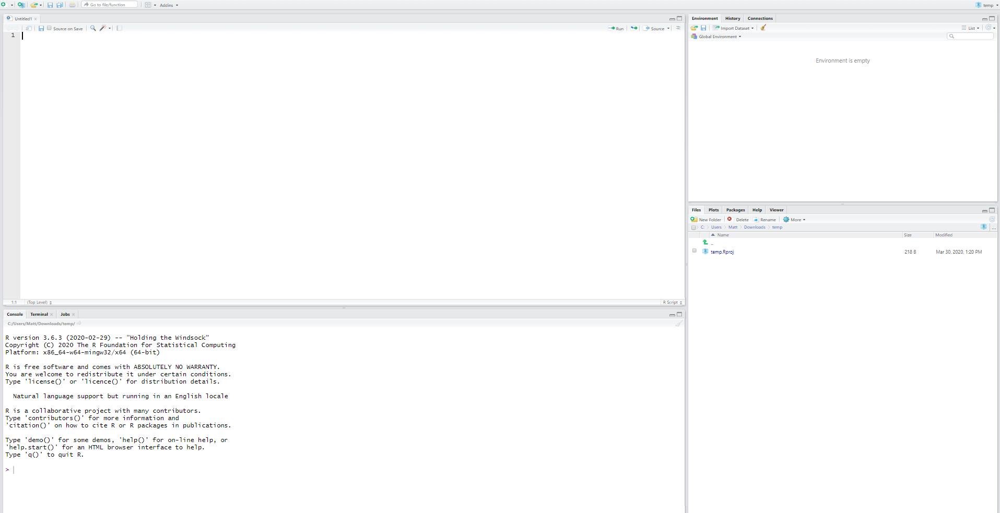
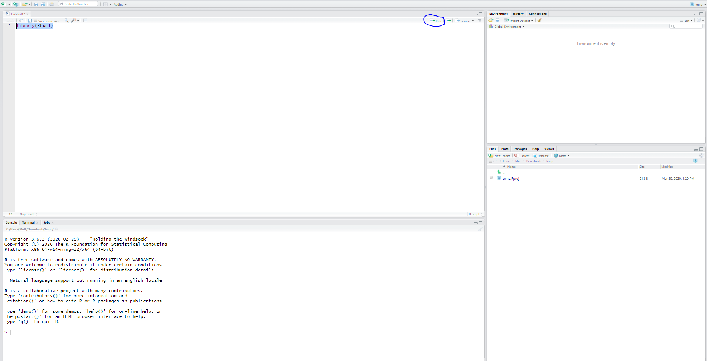

```{r setup, include=FALSE}
knitr::opts_chunk$set(echo = TRUE)
```

## How to use R studio

By now you should have logged into an ecocloud R studio session and created and saved an R script called something like 'Catch curve.r' in your workspace folder. 

If you haven't done this you should go back and follow the instructions on "How to use ecocloud" <https://github.com/UWA-SCIE2204-Marine-Systems/How-to-use-ecoloud/blob/master/README.md>

You should now be looking at a window similar to this: 

</br>

{ width=25% }

</br>

Thoughout this document there are sections that look like this (notice the blue-grey box around the text and different font):

```{r}
library(RCurl)
```

The text in these sections is R code. 

To run the code simply copy the text inside these sections, go to your ecocloud RStudio session, and paste the text into the top left corner box. 

Do this now for the 'library(RCurl)' text above. Note: you can ignore any sections with # at the start, such as the "## Warning: package 'RCurl' was built under R version 3.6.2".

Now highlight the text you just pasted and click on the run button shown in the image below:

{ width=25% }

You have just loaded extra functions into R (known as a package) that we need for this lab. 

(not using ecocloud) If you happen to be running this on R studio installed directly to your computer you probably just got an error about RCurl not being insstalled! You need to install RCurl before you can load it with library. To install R Curl. (i) Click on the 'Packages' tab in the bottom left box, (ii) click install, (iii) ensure install from is set to Repository (Cran), (iv) type in RCurl (notice the capitalisation also)  (v) click install. This should just take a minute and you will then be able to run the 'library(RCurl)' code to load the package. 


Going through the exercises below repeat this process: 
(1) **copy the text**, 
(2) Click in R script (e.g. Catch curve.R) in the top left corner and **paste the text**, 
(3) highlight the text and click **run**. 

Do not try too hard to understand how the code works - I will give you some notes on what the code is doing along the way. I am more interested in you learning how the actual catch curve analysis works. 

The order that you enter and run the text is important, so make sure you do not skip any sections. 

At the end of the lab you should have pasted all of the code from this document into the box in the top left corner of your R studio session - in your R script. If you click the save button you will be able to save and reopen this script anytime and re-run the analysis by highlighting all of the code and clicking run. 


## Description of exercise

We are going to use a linear catch curve technique to determine whether a fish stock is subject to overfishing. 

The data are simulated, but are based closely on the WA Dhufish <http://www.fish.wa.gov.au/species/wa-dhufish/Pages/default.aspx>

This is a long lived endemic species in WA and is a key indicator species for the management of WA's recreational and commercial fisheries. 

We are going to explore two different data sets. They each contain age frequency distributions of 500 fish.

The first data sets assumes constant recruitment - this means that the same number of juvenile fish enter the population each year and susequently the fishery. 

The second data set assumes variable recruitment - this means that the number of juvenile fish entering the population each year and susequently the fishery varies between years.

Variable recruitment is probably more realistic as recruitment for many fish species is driven by oceanographic features (e.g. the velocity of coastal water currents). We will talk about this more in follwoing lectures and labs. 

For each data set we want to know:

-Is overfishing occuring? And,

-Is our analysis reliable? 

## Big thanks and a disclaimer

This script was prepared largely by Alex Hesp from WA Fisheries (Department of Primary Industries and Regional Development) just for you guys. Bit of a legend!

### Disclaimer:
The author does not warrent that the information provided is free from errors or omissions. 
The author do not accept any form of liability, for the information provided, or for any
consequences arising from its use or any reliance placed upon it. The information, opinions
and advice provided may not relate, or be relevant, to a reader's/user's particular circumstance. 
Readers must evaluate the relevance for their purposes of the provided information, and actively 
seek review from the Department prior to publishing or entering into any commitment based on the information.
Opinions expressed by the author are the individual opinions expressed by that person
and are not necessarily those of the Department.


## Main analysis
### Load the constant recruitment data and have a look

```{r}
data_const <- read.csv(text=getURL("https://raw.githubusercontent.com/UWA-SCIE2204-Marine-Systems/Catch-curve/master/AgeDatWithConstRec.csv"))
```
The code above downloads the data set and loads it into your R session calling it 'data_const'. You should be able to see data_const in the top right box of RStudio (under the "Environment" tab). 

```{r}
head(data_const)
```
The head function shows you the top 5 rows of the data set. You can see that there are two columns in the data: (i) age and (ii) frequency. you should be able to see that there are no fish that are 2 years old, 5 that are 4 years old, and 19 that are 5 years old. 

```{r}
plot(data_const$Age, data_const$Frequency, "o", main="Age sample data", cex.main=1.0, 
        xlab="Age class",ylab="Frequency", frame=F, ylim=c(0,80))
```
The plot function displays the data on a graph of age against frequency.

This shows that the sample consists of very few young fish.

Frequency of abundance by age peaks at 7 years with around 65 fish. The frequency then trails off to aroud 20 years and is relatively flat above the age of 20. 

### Setting up the data

For catch curve analysis we are only interested in the ages that the fishery is impacting on. 
A common assumption is to use the peak age frequency + 1 as an indicatro of when a fish has entered the fishery. This should also correspond to the minimum legal size of capture. 

Looking at the plot we can see the peak frequency is 7 and so the cut off for the catch curve analysis should be 8. 

```{r}
MinCutOff = data_const[which.max(data_const$Frequency),"Age"] + 1
MinCutOff

plot(data_const$Age, data_const$Frequency, "o", main="Age sample data", cex.main=1.0,
        xlab="Age class",ylab="Frequency", frame=F, ylim=c(0,80))
abline(v = MinCutOff, col="red", lty=2)
```

The code above found the peak age frequency (which we already knew was 7), added 1 and storing the result (8) as MinCutOff. We then simply added a vertical line to our plot at this age to show where this minimum cut off falls in our sample. 

For catch curve analysis, we are also not interested in really old fish that are not very common in our sample. 
We will, somewhat arbitrarily, say that we are interested in all ages up to the age where the frequency of fish is just 1. The code below identifies the age where frequency first reaches 1 and then adds a vertical line at this age to our plot. 

```{r}
MaxCutOff <- data_const[match( 1 , data_const$Frequency), "Age"]
MaxCutOff

plot(data_const$Age, data_const$Frequency, "o", main="Age sample data", cex.main=1.0,
        xlab="Age class",ylab="Frequency", frame=F, ylim=c(0,80))
abline(v = c(MinCutOff, MaxCutOff), col="red", lty=2)
```

We have assumed for the catch curve analysis we are only  interested in the frequency of abundance of fish above the minimum age (8) and below the maximum age (25). These are the fish we assume are most exposed to the fishery and fishing mortality.

To help us focus on just the age groups we are interested in we can take a data subset. The code below extracts the data for the ages we are interested in and creates a new data set called data_analysis. It also plots this data subset providing us with a better view of the data we are interested in. 


```{r}
data_analysis<- data_const[ data_const$Age >= MinCutOff & data_const$Age <= MaxCutOff,  ]

plot(data_analysis$Age, data_analysis$Frequency, "o", main="Age sample data", cex.main=1.0,
        xlab="Age class",ylab="Frequency", frame=F)
```


### Catch curve analysis - estimating total mortality and fishing mortality

To estimate total mortality, catch curve analysis fits a linear model (e.g. a straight line) to our subset of the age frequency data. 

Do you think that a straight line would fit this data well? I don't really think so - after age 20 the frequency of fish is more or less flat. 

One option to fix this is to perform a natural log transformation of the frequency variable. A natural log transformation takes the frequency variable and replaced it with the natural log the frequency - e.g. a frequency of 10 will become ln(10) = 2.3. Note that the log() function in R by default takes the natural logarithm. 

The code below shows what our data looks like if we plot the natural logarithm of frequency against age. 

```{r}
plot(data_analysis$Age, log(data_analysis$Frequency), "o", main="Age sample data", cex.main=1.0,
        xlab="Age class",ylab="log of frequency", frame=F)
```

That looks better! Notice that the data seems to (approximatley) resemble a straight line.  

Now lets fit a model.

The code below fits a linear model to the log of frequency against age for our data subset. Basically it fits a straight line through the above plot. 

```{r}
CatchCurveModel <- lm(log(Frequency) ~ Age, data = data_analysis)
```


We can have a look at how the line fits through our data (don't worry about figuring out how the code works)

```{r}
EstlnFreq <- predict(lm(log(Frequency) ~ Age, data = data_analysis))
plot(data_analysis$Age, log(data_analysis$Frequency), "o", main="Age sample data", cex.main=1.0,
        xlab="Age class",ylab="Frequency", frame=F)
lines(data_analysis$Age,EstlnFreq,"l",col="blue")
```

Seems like a reasonable fit. 

Now, the whole reason we made this model was to estimate the total mortality in the population, the shorthand for total moratlity is Z. We can do this by measuring the rate at which the frequency decreases with age across our data subset - that is the slope of the blue line in our plot. 

The slope will be in the model summary(). 

```{r}
summary(CatchCurveModel)
Z <- CatchCurveModel$coefficients[[2]]*-1
Z
```

The slope, which is equal to the total mortality rate (Z), is next to Age. It is 0.23. 
In the above code we also stored the total mortality by calling it Z - you should notice 'Z' appearing in the top right box under 'Environment' along with the data sets we have loaded or created. 

### Is overfishing occuring?

You will recall from the lecture that a rule of thumb is that overfishing is not ocuring if the fishing mortality rate is less than the natural mortality rate.

To start to determine if this is likley we need to estimate the natural mortality rate.

Natural mortality can be estimated using the maximum observed age for the fish species which is 40, and using the formula below based on the paper at: <https://paperpile.com/shared/GSKSGX> We talked more about how to do this in the lecture. We are going to store the natural mortality rate in R studio as 'M', which is the commonly used shorthand for natural mortality.

```{r}
M <- exp(1.46 - 1.01*log(40))
M
```
So we now know that total mortality (Z) is 0.23 and natural mortality (M) is 0.10. 

We assume that all fish either die naturally or are caught by fishing, so we can estimate fishing mortality by F = Z - M.
Can you guess what 'F' stands for? yes, it's fishing mortality.

As we have stored in R the total mortality as Z, and natural mortality as M, we can estimate F using the following code:

```{r}
F <- Z - M
F
```

Now that we know both the fishing mortality rate (F) and natural mortality rate (M) we can assess whether overfishing is occuring. Remember from the lecture that we said a rule of thumb in fisheries science is that if the estimate of fishing mortality rate (F) is greater than the natural mortality rate (M) this suggests that overfishing is occuring. We can assess whether F is greater than M by using the code:

```{r}
F > M
```
So F is 0.12 and M is 0.10, so it appears that overfishing is indeed occuring, or at least according to this estimate. 

## Variable recruitment scenario

Lets now look at the variable recruitment scenario. We will run fairly quickly through this, so don't try and understand the code. It is more or less the same as the code you just used for the constant recruitment data. 

Firstly lets load the variable recruitment data and plot it side by side with the constant recruitment data:
```{r}
data_var <- read.csv(text=getURL("https://raw.githubusercontent.com/UWA-SCIE2204-Marine-Systems/Catch-curve/master/AgeDatWithRecVar.csv"))

par(mfrow=c(1,2))
plot(data_var$Age, data_var$Frequency, "o", main="Variable recruitment", cex.main=1.0, 
        xlab="Age class",ylab="Frequency", frame=F, ylim = c(0,130))
plot(data_const$Age, data_const$Frequency, "o", main="Constant recruitment", cex.main=1.0, 
        xlab="Age class",ylab="Frequency", frame=F, ylim = c(0,130))
```

The plots here shows the variable recruitment data on the left, and the constant recruitment data (from the previous section) on the right. 

Notice that the variable recruitment frequency data looks quite different to the constant recruitment data. Most importantly there is a huge spike in frequency at age 11 with around 120 individuals. This is much more comparable to real data on Dhu fish in WA.

Recruitment spikes might result from a "good year" where currents were favourable and/or spawning was highly successful resulting in high recruitment. 

You might be able to tell already that this is going to complicate our analysis and estimate of F. 

Lets us first look at the minimum and maximum cutoffs:

```{r}
MinCutOff = data_var[which.max(data_var$Frequency),"Age"] + 1
MinCutOff

MaxCutOff <- data_var[match( 1 , data_var$Frequency), "Age"]
MaxCutOff

plot(data_var$Age, data_var$Frequency, "o", main="Age sample data", cex.main=1.0,
        xlab="Age class",ylab="Frequency", frame=F, ylim=c(0,130))
abline(v = c(MinCutOff, MaxCutOff), col="red", lty=2)

```

Using simluated varaible recruitment data, with a recruitment spike, results in the minimum cut off shifting to 12. It was 8 in our previous example. 

Lets see what happens when we fit the standard model. 

```{r}
data_analysis<- data_var[ data_var$Age >= MinCutOff & data_var$Age <= MaxCutOff,  ]

CatchCurveModel_var <- lm(log(Frequency) ~ Age, data = data_analysis)

EstlnFreq <- predict(lm(log(Frequency) ~ Age, data = data_analysis))

plot(data_analysis$Age, log(data_analysis$Frequency), "o", main="Age sample data", cex.main=1.0,
        xlab="Age class",ylab="Frequency", frame=F)
lines(data_analysis$Age,EstlnFreq,"l",col="blue")

```

The model does not seem to fit as well as it did for the contant recruitment data. In particular, there seems to be an outlier at age 16 - it suggests there are less 16 year old fish in the sample then we might expect. 

```{r}
Z <- CatchCurveModel_var$coefficients[[2]]*-1
Z
```
Our total mortality rate (Z) is now 0.18. This is much lower than the previous estimate of 0.23. 

The rate of natural mortality rate (M) for dhufish is still the same (0.10) as it is based on the maximum observed age of the species (40). 

Now that we have the total and natural mortality rate, for this variable recruitment simulated data, we can estimate the fishing mortality rate. 

```{r}
F <- Z - M
F
```

The fishing mortality rate is 0.08. 

This is less than the natural mortality rate for WA Dhufish of 0.10, suggesting that this population is not subject to overfishing 


## Some words of caution

Both data sets we used were simulated and in principle have the same "true" fishing mortality rates. Despite this, our parralel analyses suggested two very different estimates of F. This highlights that assumptions we make in fitting models can have large effects on their interpretation. 


Some of the assuptions of our catch curve analysis include:

1) Fishing mortality is constant. Remember we estimated just one estimate of F for all fish aged 8 to 25 (in the constant recruitment data). 

2) Annual recruitment is constant. This was inherent in our first dataset but is violated by our second data set. 

3) At our minimum cut-off of peak frequency + 1 the fish population is fully exposed to the fishery (we say fully recruited to the fishery).

4) Our sample reflects the underlying age structure of the population, in other words there are no biases is sampling that misrepresent the age strucuture of the true population.

5) All fish are aged correctly - it can be quite tricky to count otolith rings and this difficluty can change as fish age and the otolthis become larger.

6) The assumed relationship between maximum age and natural mortlity rate is correct for our species.

7) The rule of thumb that Fmsy = M is true. This is a very coarse approximation. 


In the real world science of fisheries, a  range of methods will be used to assess a fish stock. Each method will have different sets of assumptions. For those interested, you can see a good example in the 2007 stock assessment for WA Dhufish (which used catch curve analysis amongst other methods) <https://paperpile.com/shared/pj8qFH> 
