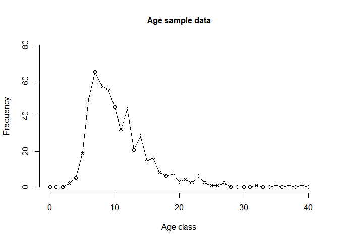

Catch curve analysis
================
Matt Navarro
10/03/2020

## how to use R studio

By now you should have all gotten yourself logged in to an ecocloud R
studio session and created and saved an R script called something like
‘Catch curve.r’ in your workspace folder.

If you haven’t done this you should go back nd check the instructions on
How to use ecocloud
<https://github.com/UWA-SCIE2204-Marine-Systems/How-to-use-ecoloud/blob/master/README.md>

You should now be looking at a window similar to
this:

</br>


</br>

thoughout this document there wll be sections that look like this:

``` r
library(RCurl)
```

    ## Warning: package 'RCurl' was built under R version 3.6.2

to run the analysis you need to copy the text inside these sections and
paste it in to the top left corner box in your ecocloud R studio
session. Do this now for the ‘library(RCurl)’ text above.

Now highlight the text you just pasted and click on the run button shown
in the image
below:


You have just loaded some extra software (known as packages) required
for this lab. Going through the exercises below repeat this process
adding to the text in the top left corner, highlighting the bit you just
pasted and clicking run. The order is important, so make sure you don’t
skip anything.

At the end of this lab you should have built up all of the script from
this document into the box in the top left corner. If you click the save
button you will be able to reopen this text anytime and re-run the
analysis by highlighting all of the script and clicking run.

## Description of exercise

We are going to use a linear catch curve technique to determine whether
a stock is being overfished. The data are simulated, but are based
closely on the WA Dhufish
<http://www.fish.wa.gov.au/species/wa-dhufish/Pages/default.aspx>

This is a long lived endemic species in WA and is a key species in WA’s
recreaitonal and commercial fisheries.

We are going to present analysis based on two data sets. They each
contain age frequencies of 500 fish. The first is based on constant
recruitment - this means that the same number of juvenile fish enter the
fishery each year. The second is based on variable recruitment - his
means that the number of juvenile fish entering the fishery varies by
year

Variable recruitment is probably more realistic as recruitment for many
fish species is driven by oceanographic features (e.g. currents). We
will talk about this more in the third lecture.

For each data set we want to know:

\-Is the stock overfished? And,

\-Is our analysis reliable?

## Big thanks and a disclaimer

This script was prepared largely by Alex Hesp from WA Fisheries
(Department of Primary Industries and Regional Development) just for you
guys. Bit of a legend\!

### Disclaimer:

The author does not warrent that the information provided is free from
errors or omissions. The author do not accept any form of liability, for
the information provided, or for any consequences arising from its use
or any reliance placed upon it. The information, opinions and advice
provided may not relate, or be relevant, to a reader’s/user’s particular
circumstance. Readers must evaluate the relevance for their purposes of
the provided information, and actively seek review from the Department
prior to publishing or entering into any commitment based on the
information. Opinions expressed by the author are the individual
opinions expressed by that person and are not necessarily those of the
Department.

## Main analysis

### Load the constant recruitment data and have a look

``` r
data_const <- read.csv(text=getURL("https://raw.githubusercontent.com/UWA-SCIE2204-Marine-Systems/Catch-curve/master/AgeDatWithConstRec.csv"))
plot(data_const$Age, data_const$Frequency, "o", main="Age sample data", cex.main=1.0, 
        xlab="Age class",ylab="Frequency", frame=F, ylim=c(0,80))
```

<!-- -->

The sample consists of very few young fish. This probably means that it
comes from a commercial or recreational fishery.

Frequency peaks at 7 years at around 65 fish.it then trails off till
aroud 20 and is relatively flat above age 20.

### Setting up the data

For catch curve analysis we are only really interested in the ages that
the fishery is impacting on. A common assumption is to use the peak age
frequency + 1. looking at the plot we can see the peak frequency is 7
and so the cut off should be 8.

``` r
MinCutOff = data_const[which.max(data_const$Frequency),"Age"] + 1
MinCutOff
```

    ## [1] 8

``` r
plot(data_const$Age, data_const$Frequency, "o", main="Age sample data", cex.main=1.0,
        xlab="Age class",ylab="Frequency", frame=F, ylim=c(0,80))
abline(v = MinCutOff, col="red", lty=2)
```

<!-- -->
We are also not interested in really old fish that aren’t necessarily
kept in the fishery. We will, somewhat arbitrarily, say that we are
interested in all ages up to the age where the frequency of fish is just
1.

``` r
MaxCutOff <- data_const[match( 1 , data_const$Frequency), "Age"]
plot(data_const$Age, data_const$Frequency, "o", main="Age sample data", cex.main=1.0,
        xlab="Age class",ylab="Frequency", frame=F, ylim=c(0,80))
abline(v = c(MinCutOff, MaxCutOff), col="red", lty=2)
```

<!-- -->

So lets take the data sub-set and plot the
data

``` r
data_analysis<- data_const[ data_const$Age >= MinCutOff & data_const$Age <= MaxCutOff,  ]
plot(data_analysis$Age, data_analysis$Frequency, "o", main="Age sample data", cex.main=1.0,
        xlab="Age class",ylab="Frequency", frame=F)
```

<!-- -->

### Catch curve analysis - estimating total mortality

Catch curve analysis involves fitting a straight line to the agre
frequency data. Do you think that a straight line would fit this data
well? I don’t really think so - at age 20+ the data is more or less
flat.

One option to fix this is to take a log transformation of the
Frequency.

``` r
plot(data_analysis$Age, log(data_analysis$Frequency), "o", main="Age sample data", cex.main=1.0,
        xlab="Age class",ylab="Frequency", frame=F)
```

<!-- -->

That looks better\!

Now lets fit a model.

The code below fits a linear model to the log of frequency against Age
for our data subset. Basically it fits a straight line through the above
plot.

``` r
CatchCurveModel <- lm(log(Frequency) ~ Age, data = data_analysis)
```

We have fit a linear model to the log of frequency against Age for our
data subset. Basically the model is fitting a straight line to the plot
above. We can have a look at the line:

``` r
EstlnFreq <- predict(lm(log(Frequency) ~ Age, data = data_analysis))
plot(data_analysis$Age, log(data_analysis$Frequency), "o", main="Age sample data", cex.main=1.0,
        xlab="Age class",ylab="Frequency", frame=F)
lines(data_analysis$Age,EstlnFreq,"l",col="blue")
```

<!-- -->

Seems like a reasonable fit.

Now, the whole reason we made this model was to estimate the total
mortality (Z) in the population. We can do this by looking at how
frequency drops off with age across our data subset - that is the slope
of the blue line in our plot.

We can have a look at the slope by looking at the model summary

``` r
summary(CatchCurveModel)
```

    ## 
    ## Call:
    ## lm(formula = log(Frequency) ~ Age, data = data_analysis)
    ## 
    ## Residuals:
    ##      Min       1Q   Median       3Q      Max 
    ## -0.46352 -0.21135 -0.04866  0.12990  0.91349 
    ## 
    ## Coefficients:
    ##             Estimate Std. Error t value Pr(>|t|)    
    ## (Intercept)  6.12123    0.28128   21.76 2.59e-13 ***
    ## Age         -0.22795    0.01626  -14.02 2.10e-10 ***
    ## ---
    ## Signif. codes:  0 '***' 0.001 '**' 0.01 '*' 0.05 '.' 0.1 ' ' 1
    ## 
    ## Residual standard error: 0.358 on 16 degrees of freedom
    ## Multiple R-squared:  0.9247, Adjusted R-squared:   0.92 
    ## F-statistic: 196.5 on 1 and 16 DF,  p-value: 2.101e-10

``` r
Z <- CatchCurveModel$coefficients[[2]]*-1
Z
```

    ## [1] 0.2279549

The slope, which is equal to the total mortality rate (Z), is next to
Age. It is 0.23.

### Is overfishing occuring?

You will recall from the lecture that a rule of thumb is that
overfishing is not ocuring if the fishing mortality rate is less than
the natural mortality rate. To start to determine if this is true we
need to estimate the natural mortality rate.

Natural mortality can be estimated using the maximum observed age for
the fish species which is 40, and using the formula below based on the
paper at: <https://paperpile.com/shared/GSKSGX>

``` r
M <- exp(1.46 - 1.01*log(40))
M
```

    ## [1] 0.1037503

So we now know that total mortality (Z) is 0.23 and natural mortality
(M) is 0.10.

All fish either die naturally or are caught, so we can estimate fishing
mortality by F = Z - M

``` r
F <- Z - M
F
```

    ## [1] 0.1242046

Finally we can assess whether overfishing is occuring by examining
whether F \> M

``` r
F > M
```

    ## [1] TRUE

So F is 0.12 and M is 0.10, so it appears that overfishing is indeed
occuring, or atleast accoding to this analysis.

## variable recruitment data

Lets now look at the variable recrtuitment
data.

``` r
data_var=read.csv("C:/GitHub/SCIE2204/Catch curve/AgeDatWithRecVar.csv", header=T, row.names = NULL)

par(mfrow=c(1,2))
plot(data_var$Age, data_var$Frequency, "o", main="Variable recruitment", cex.main=1.0, 
        xlab="Age class",ylab="Frequency", frame=F, ylim = c(0,130))
plot(data_const$Age, data_const$Frequency, "o", main="Constant recruitment", cex.main=1.0, 
        xlab="Age class",ylab="Frequency", frame=F, ylim = c(0,130))
```

<!-- -->

Notice that the variable recruitment frequency plot (on the left) looks
quite different to the constant recruitment data we have been using so
far (on the right). Most importantly there is a huge spike in frequency
at age 11 with around 120 individuals.

Recruitment spikes might result from a “good year” where currents were
favourable and/or spawning was highly successful.

You might be able to tell already that this is going to complicate our
analysis.

Lets first look at the minimum and maximum cutoffs:

``` r
MinCutOff = data_var[which.max(data_var$Frequency),"Age"] + 1
MaxCutOff <- data_var[match( 1 , data_var$Frequency), "Age"]
plot(data_var$Age, data_var$Frequency, "o", main="Age sample data", cex.main=1.0,
        xlab="Age class",ylab="Frequency", frame=F, ylim=c(0,130))
abline(v = c(MinCutOff, MaxCutOff), col="red", lty=2)
```

<!-- -->

Instantly because of this recruitment spike, the minimum cut off has
shifted to 12. It was 8 in our last analysis.

Lets see what happens when we fit the
model.

``` r
data_analysis<- data_var[ data_var$Age >= MinCutOff & data_var$Age <= MaxCutOff,  ]

CatchCurveModel_var <- lm(log(Frequency) ~ Age, data = data_analysis)
EstlnFreq <- predict(lm(log(Frequency) ~ Age, data = data_analysis))
plot(data_analysis$Age, log(data_analysis$Frequency), "o", main="Age sample data", cex.main=1.0,
        xlab="Age class",ylab="Frequency", frame=F)
lines(data_analysis$Age,EstlnFreq,"l",col="blue")
```

<!-- -->

The model does not seem to fit as well as it did for the contant
recruitment data. In particular, there seems to be an outlier at age 16.

``` r
Z <- CatchCurveModel_var$coefficients[[2]]*-1
Z
```

    ## [1] 0.1839866

``` r
F <- Z - M
F
```

    ## [1] 0.08023633

Our total mortality rate (Z) is now 0.18. This is much lower than the
previous estimate of 0.23.

This corresponds to a fishing mortality rate of 0.08.

This is less than the narural mortality rate for WA Dhufish of 0.10,
suggesting that we don’t think this population is overfished.

## Some words of caution

Catch curve analysis has a lot of assumptions. These include:

1)  Fishing mortality has been constant. Remember we estimated just one
    number for all fish aged 8 to 25.

2)  Annual recruitment is constant. This was inherent in our first
    dataset but is violated by our second data set.

3)  At our minimum cut-off of peak frequency + 1 the fish population is
    fully exposed to the fishery (we say fully recruited)

4)  Our sample reflects the underlying age structure of the population

5)  All fish are aged correctly - it can be quite tricky to count
    otolith rings

6)  The relationship between maximum age and natural mortlity rate is
    true for our species

7)  The rule of thumb that Fmsy = M is true. This is a very coarse
    approximation.

Often in assessing a fish stock a whole range of methods will be used
with different sets of assumptions. For those interested, you can see a
good example in the 2007 stock assessment for WA Dhufish (which used
catch curve analysis amongst other methods)
<https://paperpile.com/shared/pj8qFH>
